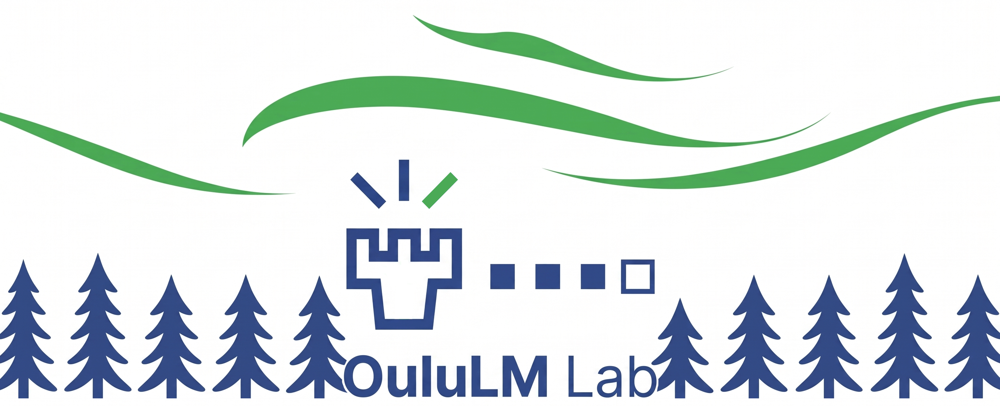
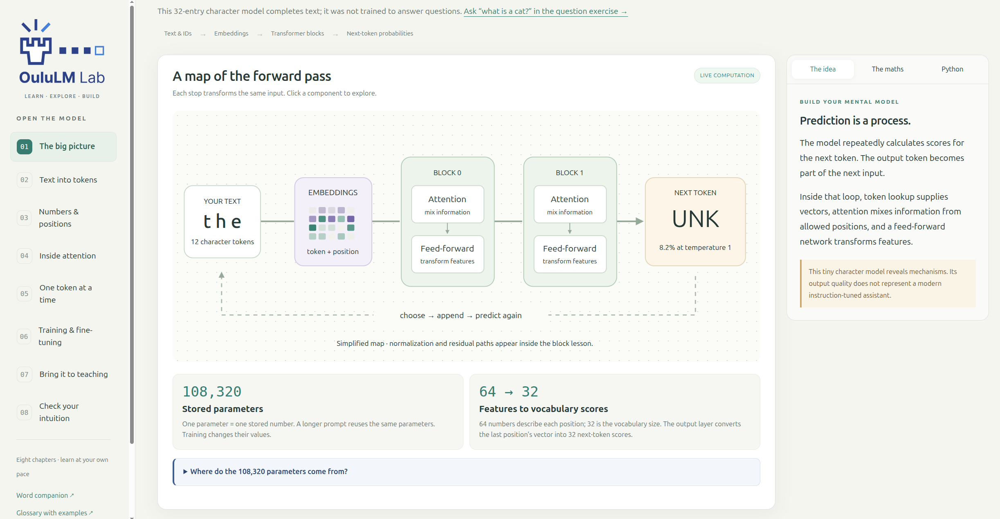

# OuluLLM Lab



**OuluLLM Lab provides toolkits for learning and development with language models (LLMs), vision-language models (VLMs) and multimodal language models (MLLMs).**

| Area | Purpose | Available now |
| --- | --- | --- |
| [learning/](learning/README.md) | Guided explanations, interactive experiments and runnable examples | [Open the model: LLM workshop](learning/llm-workshop-001/README.md) |
| [development/](development/README.md) | Reusable tools for building and evaluating model applications | Reserved for future toolkits |

## Start learning



*Screenshot of the interactive interface for learning how language models work.*

Download or clone this repository, then open **[the interactive workshop](learning/llm-workshop-001/index.html)** in your browser. GitHub's file viewer shows source; download the repository to run the HTML, or use a static website deployment. No installation, API key or network connection is needed for the main character and word experiments.

For live domain-model generation and Python examples, follow the [workshop setup](learning/llm-workshop-001/README.md#python-setup). The Python server runs locally; GitHub Pages cannot execute Python.

This first release focuses on LLM learning. VLM and MLLM toolkits are planned areas, not currently implemented features.

## Author and acknowledgements

Created and curated by **Dr. Constantino Álvarez Casado**, Postdoctoral Researcher, University of Oulu. The code was developed mostly with AI assistance from **ChatGPT 5.6 Sol, 6 Astra, and Claude Opus 5**, together with the author. These tool/model names are recorded as supplied by the author. The author selected the educational goals, iterated on the implementation and reviewed the examples. AI assistance does not guarantee correctness; inspect the code, tests and measured outputs.

See the workshop [references and acknowledgements](learning/llm-workshop-001/llm_workshop/references.html) and [data provenance](learning/llm-workshop-001/data/README.md).

## How to cite

Álvarez Casado, C. (2026). *OuluLM Lab: Toolkits for learning and development with language models* [Computer software]. https://github.com/Multimodal-Sensing-Lab/oululm-lab

```bibtex
@software{alvarez_casado_oululm_lab_2026,
  author = {Álvarez Casado, Constantino},
  title = {{OuluLM Lab}: Toolkits for learning and development with language models},
  year = {2026},
  url = {https://github.com/Multimodal-Sensing-Lab/oululm-lab}
}
```

For reproducibility, also record the release tag or commit hash you used. If you used the introductory workshop, identify **Workshop 001: LLM basics — Open the model** in your methods or teaching-materials description. Machine-readable citation metadata is provided in [CITATION.cff](CITATION.cff).

## License

The original code and learning toolkit, including our original explanations, diagrams and tiny model weights, use the [MIT License](LICENSE). The supplied synthetic CSVs retain their documented CC0 dedication; their generator scripts use MIT. External publications and optional downloaded datasets retain their own terms; links do not relicense those works. See [THIRD_PARTY_NOTICES.md](THIRD_PARTY_NOTICES.md).

## Repository structure

```text
learning/llm-workshop-001/   Participant workshop, data and recorded tiny models
development/            Future development toolkits
assets/                 Lab branding
```

The public package contains participant resources. Presentation decks, speaker scripts, facilitator guides, personal environment files and download caches are excluded.

## Check or host this copy

Run `node tools/check-release.cjs` to verify local links, excluded files, checkpoint hashes and file sizes. To host the static browser, serve this repository root or configure a static site with `index.html` as its entry. The root `.nojekyll` preserves paths beginning with underscores. Static hosting supports the character/word demos and saved domain previews; live domain generation still requires the local Python server.
